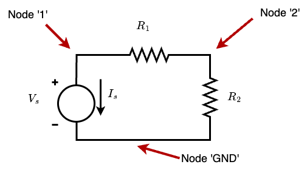
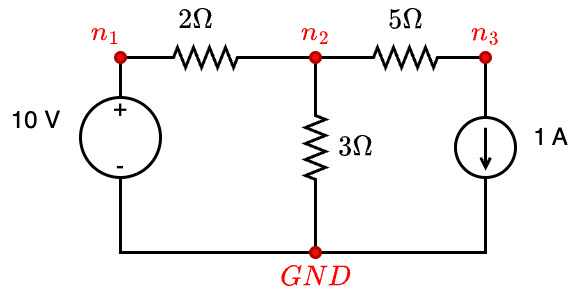

# Assignment 2 - SPICE simulation

[SPICE](https://ngspice.sourceforge.io/) is a circuit simulator.  There are many different variants of SPICE that are used in Electrical and Electronics, and there are many commercial variants as well.  SPICE was primarily designed for Integrated Circuit (IC) design, so there are many features there such as transistor-level simulation and non-linear elements that may not be relevant in the early stages of EE, but at the most basic level, it needs to be able to solve Kirchhoff's laws to find the voltages and currents in a circuit.

For this assignment, we will restrict ourselves to purely resistive networks without dependent sources.  So the types of circuit elements we need to deal with are:

- Independent voltage sources of fixed magnitude
- Independent current sources of fixed magnitude
- Resistances of known value

As you will see, it is quite straightforward to extend this to other passive elements like inductors and capacitors (for AC analysis) and to dependent sources.  However, this assignment will not test those cases.

## Circuit Solving

A circuit can be represented as a *graph* - a structure that has *nodes* and *edges*.  Each node in the graph is a point where two or more elements meet.

{ width=50% }

The circuit above shows a very simple example of a circuit.  Here there are 3 *nodes*: they are labeled `1`, `2` and `GND`, but the labels could be any string in general.  The node labeled `GND` is special - since voltages are relative, we need to select exactly one node in the circuit as the *ground* potential, and this is usually given the special label name `GND`. 

The circuit has a fixed independent voltage source $V_s$, and two known resistances $R_1$ and $R_2$.  We want to find the voltages at the nodes `1` and `2`, and also the current through the voltage source.

### Unknown values

To simplify the discussion, we can therefore assume that when we have *N* nodes in the circuit, there are *N* unknown voltages that we need to solve for.  In practice the `GND` node is known to be 0 V, so this is not really an unknown, but we can add it to the list of equations anyway.

This means that we can write Kirchhoff's current law (KCL) equations at each of the nodes, and will get *N* equations.  However, there are some problems:

- KCL equations at all *N* nodes will end up being redundant: they can only solve for *N-1* variables.  For instance, as long as the KCL equations at nodes `1` to `N-1` are satisfied, it will automatically imply that the `GND` node equation is also satisfied.  So this actually only gives us *N-1* equations.
- The current through a voltage source is not a direct function of the voltage, so in effect that current ($I_s$ in the example circuit above) is also unknown.  So we need some more equations to solve for these currents.

We can therefore add a few *auxiliary* equations here: for each independent voltage source, there is an equation relating the voltages at each of the end nodes.

In the example above, the relevant equations would be as follows:

#### Current balance
$$
\begin{aligned}
I_s               & + & \frac{V_1-V_2}{R_1}     & = & 0 \\
\frac{V_2-0}{R_2} & + & \frac{V_2-V_1}{R_1}     & = & 0 
\end{aligned}
$$

#### Voltage
$$
\begin{aligned}
V_1 & - & 0 & = & V_s
\end{aligned}
$$

which can be written in Matrix form as:

$$
\begin{bmatrix}
\frac{1}{R_1}   & \frac{-1}{R_1}              & 1 \\
\frac{-1}{R_1}  & \frac{1}{R_1}+\frac{1}{R_2} & 0 \\
1  & 0  & 0
\end{bmatrix}
\begin{bmatrix}
V_1 \\
V_2 \\
I_s
\end{bmatrix}
=
\begin{bmatrix}
0 \\
0 \\
V_s
\end{bmatrix}
$$

## Circuit representation

We use a text based format to represent circuits.  For the example above, we can represent it as follows (the whitespace here is just for formatting, it does not have significance):

```spice
.circuit
Vs   1 GND  dc 2
R1   1   2     1    
R2   2 GND     1  
.end
```

Similarly, we could also have another circuit as follows:

{ width=50% }

```spice
.circuit
Vsource n1 GND dc 10
Isource n3 GND dc 1
R1 n1 n2 2
R2 n2 n3 5
R3 n2 GND 3
.end
```

## Problem Statement

You need to write a function that will:

- take a filename as input
- read the file and parse it into lists of different components.  For example, you may create a list of voltage sources, list of current sources etc.  Or you could choose to have a single list, but the components have some dictionary like structure that allows you to store things like:
  - component name
  - nodes to which the component is connected (you should be able to use the names of the nodes)
  - For doing the above, you may need to use some kind of dictionary
- Create a list of nodes in the circuit, and assign consecutive numbers to the nodes.  You can assume there is always one node called `GND` to which you assign the number 0, but other nodes can be in any order.  In particular, just because a node is called $n_1$ does not mean it must have the number 1 assigned to it.
- Use the above mapping of node names to numbers, to populate a matrix with all the values required to create the circuit equation matrix as discussed in the example above.  
  - Note: you can use `numpy` arrays for this - even if you have a solution that uses list of lists, modify this to use numpy arrays instead.
- Solve the equation: you can use any method including `numpy.linalg.solve` for this.

### Return Value

You should return two values `(V, I)` which will contain the voltages and currents of each node and branch respectively.  A node is identified by its name, so for example, we may want `V['GND']` or `V['n1']`.  The return values should be of type *float*.

Currents can be of 3 types in the present problem:

- current through a constant current source (`I` type).  This need not be reported as it is fixed by the input circuit.
- current through a resistance (`R` type).  This again need not be reported as it can be directly computed given the node voltages at each end of the resistance.
- current through a voltage source.  This must be computed using the equations you set up above, and you should return it as a function of the voltage source name.  For example `I['Vs']`.

You should also take care to catch and report error conditions.  A couple of examples are given below that are tested with the given test cases, but you should also consider whether there are any other possible scenarios and catch those.

- If the circuit contains a loop of voltage sources, or a node with all current sources entering a node, this will reflect in the equations you are trying to solve.  You should catch such a scenario and `raise ValueError` to indicate that there is a problem with the input circuit.

- If there is an error in the circuit parsing (extra parameters, missing voltage, resistance values etc.) you should `raise ValueError`.

## Submission

You are given a set of `pytest` test cases.  These will call the function `evalSpice` with a filename as input.  You should write your functions in a file called `evalSpice.py` so that it can be properly imported by `pytest` for testing.  

You may use additional functions in this or other files, but do not change the name `evalSpice.py`.  If you make any changes to the `test_evalSpice.py` file, they will be ignored during grading, as we will be checking with other test cases that are not specified now.

Your code should contain suitable comments to explain how you have approached the problem solution.

In addition to the Python code, you need to submit a PDF file called `README.pdf` which contains a description of your solution.  This should include any references you have looked up, mention any discussions you have had with other classmates or colleagues, and give details of any special cases or extra tests that you have implemented.  Note that in general the extra tests do not guarantee a better grade, but will be taken into account in borderline cases.

### Summary of files

Your submission (say `ee42b123.zip`) should contain the following structure:

```
ee42b123/           # Folder to be created when file unzipped
    evalSpice.py    # Your code with comments
    README.pdf      # generate with pandoc or Jupyter 
```

In particular, you need not submit the `test_evalSpice.py` or `testdata` folders.  These will be replaced with other test cases that may or may not include the tests that were given in the problem statement.

In case you want to show any other test cases that you have created or tested for, create a separate folder called `extra` under `ee42b123/` and put the files there.  Your README file should contain a clear explanation of what you have done.
